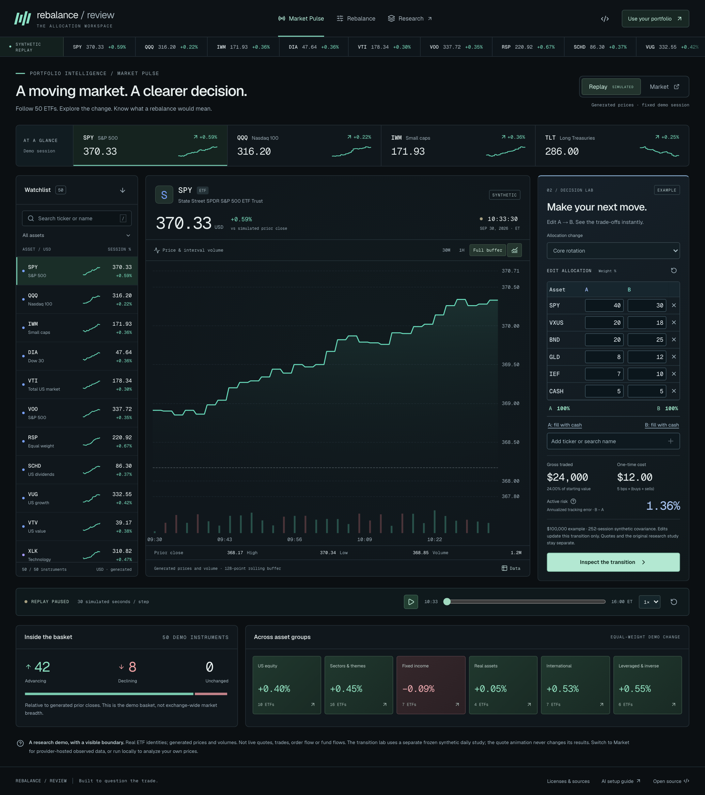
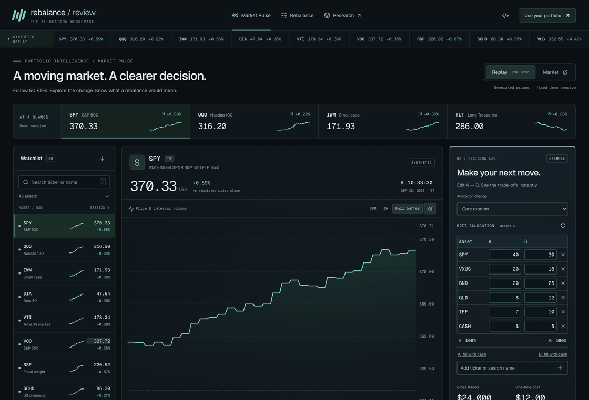
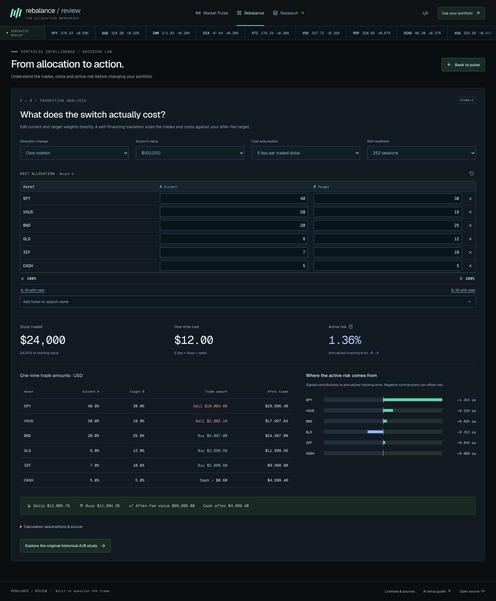
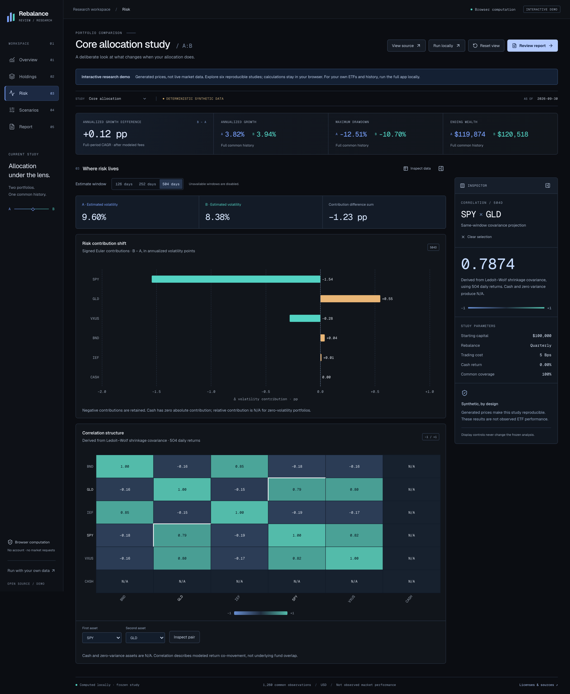

# Rebalance Review

**Understand the trade-off before you rebalance.** Explore the market, compare ETF allocations, inspect the trades and risk behind a rebalance, and record the reason for your decision.

[**Try the interactive demo →**](https://yz3639-gif.github.io/rebalance-review/?v=market-pulse-20261007) · [Quick start](#quick-start) · [Have an AI set it up](#have-an-ai-set-it-up) · [Methods](#what-is-calculated)

[](https://yz3639-gif.github.io/rebalance-review/?v=market-pulse-20261007)

The new **Market Pulse preview** combines a flowing 50-ETF **synthetic replay**, an editable **A→B transition lab**, and optional **TradingView market widgets** with provider-defined delays. Edit weights directly beside the chart, add tickers, or fill the remainder with cash. Trades and fees recalculate when both allocations total 100%. Synthetic prices are labeled throughout and never presented as observed quotes. Embedded market quotes are not read into our calculations. Run the connected local app for historical analysis with your own source data.

The demo is published from `main` after its GitHub Pages build and browser checks pass. [Deployment status](https://github.com/yz3639-gif/rebalance-review/actions/workflows/pages.yml). To try the workspace locally: `npm run build:demo`, then `npm run preview:demo`; open **http://127.0.0.1:4175/rebalance-review/**. [Preview guide and calculation boundaries](docs/MARKET_PULSE.md).

[](docs/MARKET_PULSE.md)



## Quick start

Use **Node.js 24.21.0**, the exact version in [`.nvmrc`](.nvmrc). Python, a database, a hosting account and an API key are not required for ordinary use.

**From GitHub:**

```sh
git clone https://github.com/yz3639-gif/rebalance-review.git
cd rebalance-review
npm ci
npm start
```

**From a downloaded ZIP:** extract it, open a terminal inside the folder containing `package.json`, then run:

```sh
npm ci
npm start
```

Open **[http://127.0.0.1:8787/design/](http://127.0.0.1:8787/design/)**. This address runs on **your computer**, while the terminal remains open. `npm start` builds the frontend and starts the complete local Cloudflare Worker, including market-data routes. Stop it with `Ctrl+C`.

Fresh local reviews select **Yahoo Finance · local personal research · no key**. Enter two allocations totaling 100%, then choose **Compare portfolios**. The app requests actual adjusted daily history; provider availability and sufficient common history are still required. **Load example** offers an independent, labeled synthetic walkthrough.

If port 8787 is occupied, leave that service alone and run:

```sh
npm start -- --port 8788
```

Then open `http://127.0.0.1:8788/design/`. Initial installation and real price requests need internet access. If you already use `nvm`, `nvm install && nvm use` selects the pinned Node version.

## Have an AI set it up

Open the extracted/cloned folder in a coding assistant **with terminal and file access**. A chat-only assistant cannot run the app. Copy either prompt below; both ask it to check the running application, not merely print instructions.

**English — copy and paste:**

```text
Set up and run Rebalance Review on my computer. Find the project folder containing
package.json, .nvmrc and scripts/start.mjs; read README.md and docs/AI_QUICKSTART.md.
If the project is absent, clone https://github.com/yz3639-gif/rebalance-review.git
into a new folder without overwriting existing work. Use exactly Node 24.21.0
from .nvmrc; install it in user space if needed and keep my other Node versions.
Run npm ci, then npm start. Do not substitute a Vite-only server. If port 8787 is
occupied, use npm start -- --port 8788 and adjust all checks and links. Keep the
server running. Verify HTTP /design/ and /api/providers/local/status, then use a
browser to run a labeled synthetic example. Also try a separate SOXL/SPY comparison
with the local no-key Yahoo connection and report its actual success or error.
Never substitute synthetic prices for a failed market request. Do not edit version
requirements, replace the lockfile, downgrade dependencies or suppress errors to
force startup. API keys belong in the app UI, never this chat or source files.
Finish with the actual local URL, exact checks completed, and any remaining issue.
Do not claim success from a build alone or stop the server after checking it.
```

**中文 — 直接复制：**

```text
请直接在我的电脑上配置并运行 Rebalance Review。先找到包含 package.json、
.nvmrc、scripts/start.mjs 的项目目录，阅读 README.md 和 docs/AI_QUICKSTART.md。
如果还没有项目，从 https://github.com/yz3639-gif/rebalance-review.git 克隆到新目录，
不要覆盖已有文件。使用 .nvmrc 指定的 Node 24.21.0；缺少时在用户目录安装，
保留其他 Node 版本。执行 npm ci，再执行 npm start，不能只启动 Vite。
8787 被占用时改用 npm start -- --port 8788，并同步修改所有检查地址。
保持服务运行，检查 /design/ 和 /api/providers/local/status 的实际 HTTP 响应，
再用浏览器完成一次明确标注的合成示例。另开一次 SOXL/SPY 本地免 key 行情比较，
如实报告真实请求成功或失败，不能在失败时偷偷换成合成价格。
不要通过修改版本要求、替换锁文件、降低依赖版本或屏蔽报错来假装运行成功。
API key 只能让我在产品界面输入，不要索取到聊天中，也不要写进源码。
最后给出实际可打开的本地地址、已完成的检查及未解决问题；仅构建通过不算完成，
检查结束后不要关闭服务。
```

The [detailed AI setup guide](docs/AI_QUICKSTART.md) adds environment checks, acceptance steps and troubleshooting.

## A three-minute walkthrough

1. **Choose a starting point.** Use **Load example** to explore synthetic data immediately. For a personal comparison, enter ETF codes or names in the allocation editor. Try A: `SPY 100%`; copy A to B and change B to `SPY 80% / SOXL 20%`. These are functional test inputs, not an allocation recommendation.
2. **Compare.** Locally, keep the Yahoo connection selected and choose **Compare portfolios**. Both sides use the same common dates and assumptions. Adding `CASH` requires confirmation of its modeled 0% return. The ticker `USD` is an ETF, not cash.
3. **Inspect the trade-off.** Drag the date range in Overview, select an asset in Holdings, inspect its contribution in Risk, and compare the recorded trading-cost scenarios. Date zoom changes the view, not the full-period statistics.
4. **Record the decision.** In Report, enter a reason and next-review date. The local synthetic example supports saving, reopening and full report downloads. Real-source permissions determine which actions are available; Yahoo local and Tiingo default to a **decision-only PDF** containing your own inputs and reasoning.

| View | Explore |
|---|---|
| **Overview** | Linked wealth/drawdown charts, date inspection, range controls, USD or Index 100 |
| **Holdings** | A/B weights, changes and uncovered positions; linked asset inspector |
| **Risk** | 126/252/504-return windows, signed risk contributions and correlation pairs |
| **Scenarios** | Calculated 2/5/10/20 bps costs and an extra-one-trading-session execution path |
| **Report** | Paginated preview, Chinese text support, notes, next-review date and permitted exports |

**Inspect what drives the risk.** Contribution changes and the correlation matrix use the same selected covariance window.

[](https://yz3639-gif.github.io/rebalance-review/?v=market-pulse-20261007)

**See exactly what changes.** Compare original weights, inspect an ETF, and keep excluded positions visible.

[View the holdings comparison screenshot](docs/media/terminal-holdings.png).

<details>
<summary><strong>Watch the interactive walkthrough</strong></summary>

[Open the original five-view research walkthrough](docs/media/terminal-preview.gif).

</details>

**Edit portfolios & data** returns to your inputs. **Saved reviews** opens the local journal. Old reviews retain their recorded identity, data dates and permissions; they are not silently recomputed.

## Data and privacy

The optional **Market** demo mode connects to TradingView, which receives the selected public symbol and normal browser connection information. Its embedded data, delay and privacy policy are controlled by the provider. **Replay starts without market-provider requests.** Unsaved demo allocation drafts stay in memory, but provider scripts in Market run in the same page and are not a security isolation boundary. [Widget boundaries and attribution](docs/market-data-modes.md).

| Connection | Setup | What to expect |
|---|---|---|
| **Yahoo local research** | `npm start`; no key | Actual adjusted daily history through an **unofficial** public interface. Local-only personal research; no availability guarantee. |
| **CSV** | Import a permitted long/wide CSV | USD split-and-distribution-adjusted closes or total-return indices; preview mapping before applying. |
| **Tiingo** | Enter your own key in the app | Restricted same-origin connection; access depends on your account and plan. |
| **Custom REST** | Configure HTTPS endpoint and mapping | Browser-direct JSON/CSV requests; the service must support browser CORS. |

Calculation, allocation weights, decision notes and PDF rendering stay in the browser. Price requests send the selected ticker/date range to the provider; Tiingo also receives your key through the restricted proxy. Credentials stay in memory and are excluded from archives, reports and configuration exports.

Yahoo local and Tiingo prices are released after calculation and requested again for the next comparison. Their default policies disable raw/derived saving, full analytical exports and public display. A free endpoint or personal key is not a redistribution license. CSV/custom-source rights are separately declared and checked. No observed market-price dataset is bundled with this repository.

The app supports **up to 50 distinct ETFs across A and B, plus cash**. A directory match does not guarantee provider coverage. Standard ETF reviews require at least **253 common daily price observations**; dates, identity, USD currency, adjustment basis and source permissions must pass validation. There is no silent filling, stale-data substitution or synthetic fallback.

[Provider setup](docs/PROVIDERS.md) · [CSV formats](docs/DATA_FORMATS.md) · [Privacy](docs/PRIVACY.md)

## Troubleshooting

| Symptom | What to do |
|---|---|
| **“Import market prices first. Your holdings have been preserved.”** | CSV mode has no applied price dataset. Under **Price data connection**, choose the local Yahoo connection after `npm start`, configure Tiingo/custom API, or import and apply a CSV. Entering holdings alone does not load prices. |
| **Yahoo option is missing** | Use `npm start` and the loopback URL. The hosted demo, Vite-only server and `npm run preview:full` do not enable this local-only connection. Check `/api/providers/local/status`; local startup should return `{"enabled":true}`. |
| **SOXL does not appear in the analysis search** | **Holdings** filters assets already in the result. Use **Edit portfolios & data**, then the allocation editor's symbol/name search, to add another ETF. |
| **Data ends before today** | Daily history uses the previous trading session, not an intraday quote. **AS OF** is the last observation actually used. Synthetic examples have a fixed, labeled cutoff. Automatic real-data requests reject missing final sessions. |
| **Node version / port error** | Use exactly `.nvmrc`'s Node version. For an occupied port, choose `npm start -- --port 8788`; do not terminate an unrelated service. |
| **Provider unavailable, limited or insufficient history** | Keep your inputs, read the error, and retry later or use permitted CSV/Tiingo history. Newly launched ETFs may lack 253 common prices. No data source is silently substituted. |
| **Save or full PDF is unavailable** | Check the displayed source permissions. Yahoo local/Tiingo are calculation-only; use the decision-only PDF. A local synthetic example can demonstrate the full save/report workflow. |

## What is calculated

- **Transition lab (preview):** current-to-target dollar trades, self-financing post-fee allocations, gross turnover, and annualized active risk with signed contributions. The lab uses a frozen synthetic study and illustrative account values, independently of moving quotes.
- **Risk:** centered Ledoit–Wolf covariance, annualized by 252, with 126/252/504-return windows. Signed Euler contributions reconcile to portfolio volatility. Cash covariance is zero; relative contributions and correlations involving zero-variance assets are N/A.
- **Replay:** a self-financing cash ledger, initial purchase fees and monthly/quarterly/buy-and-hold schedules. Rebalancing signals execute at the next supplied close; no forced terminal trade. Costs and an additional one-session delay are separate calculated scenarios.
- **Comparison:** latest common history capped at five calendar years, consistent inputs on both sides, explicit partial-coverage handling and original allocations preserved in reports.
- **Calendar:** reproducible US equity sessions from 1990 through 2028; future extraordinary closures need reviewed updates.

These are hypothetical replays of selected weights, not actual account returns, forecasts or evidence of investment alpha. Leverage is reflected in the supplied ETF return history; a daily leverage multiple is not projected over a longer period. Taxes, deposits, withdrawals and broker execution are outside the model.

## Engineering contribution

The original work is the A/B comparison contract, input/provenance state machine, coverage handling, cash ledger, browser numerical engine, validated provider adapters and permission-aware report/journal workflow. Web Workers isolate calculation and PDF generation; the presentation receives snapshots without credentials or raw history.

Established libraries handle charts (**ECharts**), PDF layout (**react-pdf**), CSV parsing, schema validation and local storage. Independent NumPy/SciPy/scikit-learn references check numerical outputs. Source permissions and application code licenses are separate. [References](docs/REFERENCES.md) and [third-party notices](THIRD_PARTY_NOTICES.md) distinguish direct dependencies, reference designs and original code.

## Verify independently

Run these in a clean checkout with the pinned Node version:

```sh
npm ci
npm run typecheck
npm test
npm run build
```

<details>
<summary><strong>Browser, numerical and delivery checks</strong></summary>

Install the matching Playwright browsers and run the browser suite:

```sh
npx playwright install chromium firefox webkit
npm run test:e2e
```

For a real local Worker check, keep `npm start` running in a separate terminal on port 8787:

```sh
npm run verify:worker
```

Numerical regeneration additionally uses **uv 0.12.21** and locked **Python 3.11.16**. Neither is needed to use the app.

```sh
uv sync --locked
npm run oracle:check
npm run oracle:expanded:check
npm run calendar:check
uv run --locked python -m unittest discover -s oracle -p 'test_*.py'
npm run deploy:check
npm audit --audit-level=high
```

See [oracle instructions](oracle/README.md) for generating references rather than only checking them. The reference tools run within this repository; an older private research checkout is not required.

Create and independently validate a candidate ZIP:

```sh
release_version=$(node -p "require('./package.json').version")
release_zip="../releases/rebalance-review-v${release_version}.zip"
npm run package:release
python3 scripts/verify_archive.py "$release_zip" --full --output "${release_zip%.zip}-local-verification.json"
python3 scripts/verify_ubuntu.py "$release_zip" --output "${release_zip%.zip}-ubuntu-verification.json"
```

The Ubuntu check requires Docker. Verification writes separate results bound to the ZIP, source and build hashes; it does not modify the input ZIP. Rerun affected checks after changes. Do not infer a passed remote CI run or accepted release from a workflow file's presence.

</details>

Synthetic and mocked-provider tests verify engineering behavior. A successful live request verifies that particular connection at that time. Authenticated Tiingo access, public service operation, physical phones and real-user trials each need their own evidence. Neither a build nor the hosted synthetic demo establishes all those conditions.

<details>
<summary><strong>Architecture, deployment and maintenance</strong></summary>

`npm run build` produces `dist/`. The full application uses Cloudflare Worker + Static Assets; deployment credentials stay in the hosting/CI account, never Vite variables. The GitHub Pages experience is a static synthetic demonstration, not the Worker backend. The Yahoo connection is restricted to explicitly enabled loopback startup; it is not a public quote proxy. See [deployment and rollback](docs/DEPLOYMENT.md).

To build the same interactive demo shown on the project homepage:

```sh
npm run build:demo
npm run preview:demo
```

Open `http://127.0.0.1:4175/rebalance-review/`. The separate `dist-demo/` output contains Market Pulse, the synthetic transition/research tools and optional provider-hosted market widgets; it does not include the connected local controller. The Pages workflow tests that project subpath before deployment. The README screenshots and GIF are captures of the synthetic running demo; no chart values are edited. To regenerate Market Pulse media, run `node scripts/capture_pulse_media.mjs` then `python3 scripts/assemble_pulse_gif.py` (optional Pillow). The original research captures use `scripts/capture_demo_media.mjs` and `scripts/assemble_demo_gif.py`. Neither media script permits external market requests. Media tooling is not needed to run the application.

For frontend development, `npm run dev` uses the optional API proxy to a separate full Worker on port 8787. Use `npm start` for normal local use and end-to-end checks.

Archives use schema v2. Existing v1 records remain historical snapshots; a new review writes v2 without modifying the old record. Browser storage is optional, not a cloud account or encrypted vault. Review dates do not schedule notifications.

[Exact-source provenance](scripts/upstream-licenses.json), [runtime SBOM](public/sbom/runtime.cdx.json) and [development SBOM](licenses/sbom/development.cdx.json) accompany the source. `/licenses/index.html` serves preserved notices. Documented upstream license-text gaps or conflicting declarations remain visible.

The scoped Miniflare → `sharp@0.35.5` override addresses GHSA-wq5f-xc86-pv6w. Remove it once the pinned runtime resolves a fixed dependency, then repeat native Linux installation, Worker and PDF checks. Dependency-audit results are time-specific.

</details>

[License](LICENSE) · [Technical walkthrough](docs/DEMO_AND_TECHNICAL_GUIDE.md) · [Report an issue](https://github.com/yz3639-gif/rebalance-review/issues)
